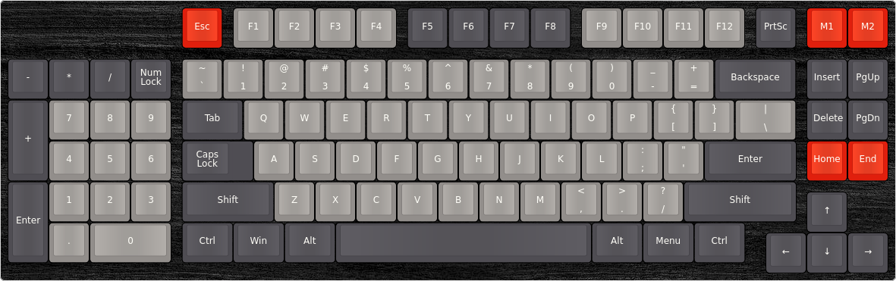
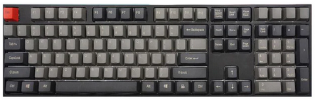
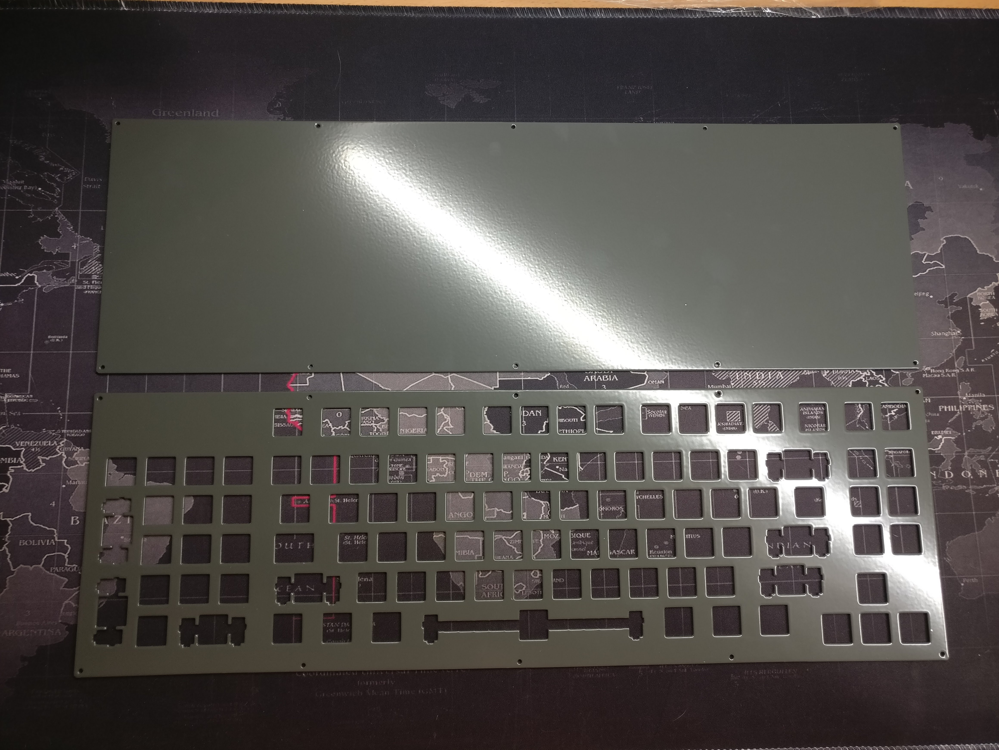
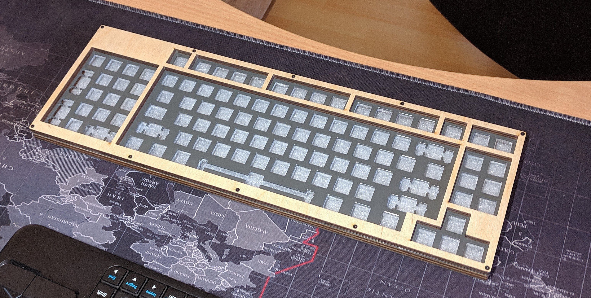
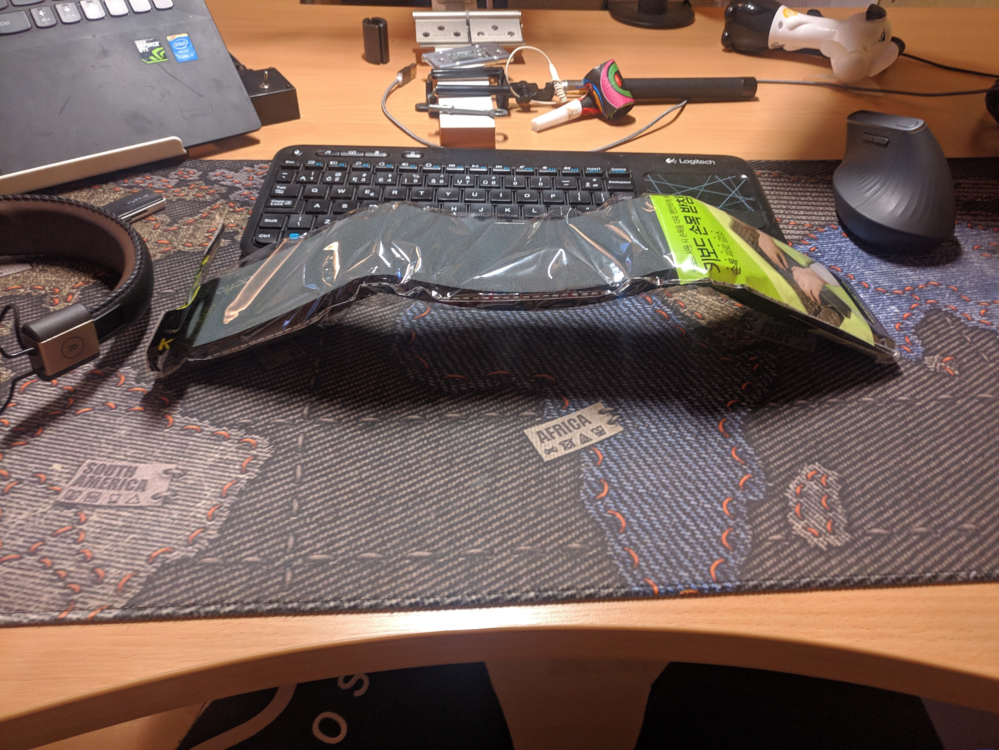
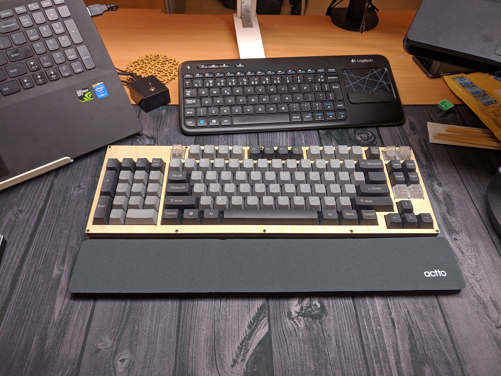
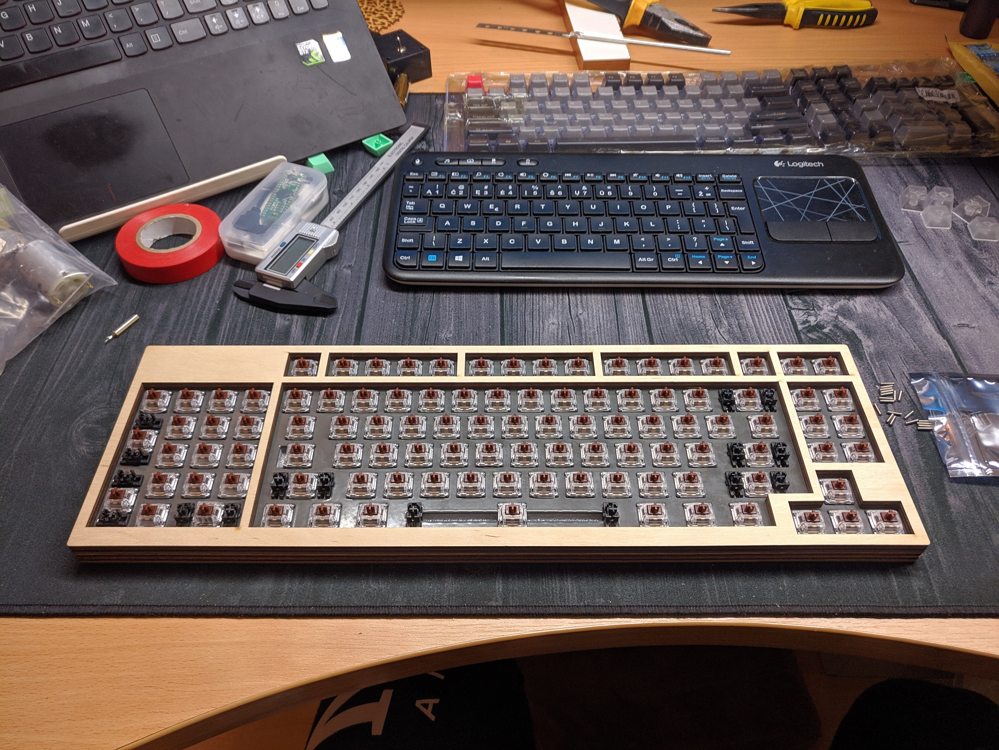
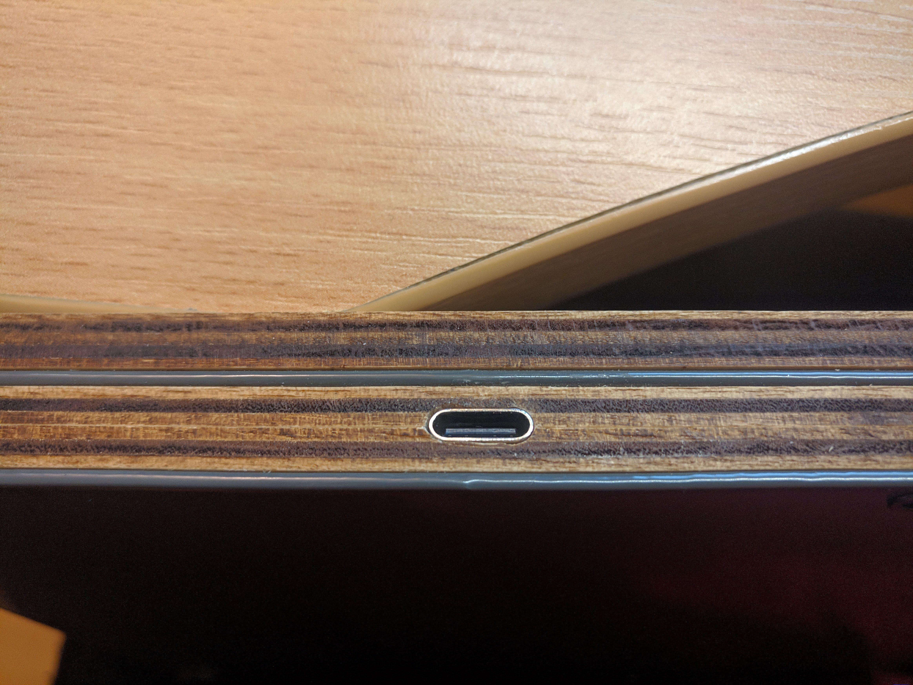
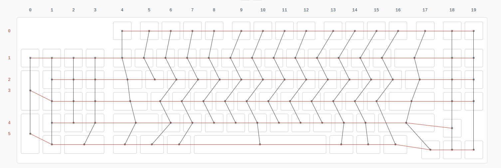

# Bleeding Charcoal (mk-ltk-01)

[First Idea](./images/mk-ltk-01.png)

## Initial Requirements
* As low prifile as possible
* Reasonable price around 100€ (failed! 170€)
* NOT flat profile keycaps
* Tactile
* Left side num pad
* Stardart layout (keycaps wise)
* Make most space for mouse withour loosing functionality (on the right)

## Tools
* http://www.keyboard-layout-editor.com
* http://builder.swillkb.com/
* https://kbfirmware.com/
* https://noroadsleft.github.io/kbf_qmk_converter/

## Decisions made
* Sandwich case (stained plywood and painted black steel)
*  
  Unfortunatelly to high for low profile switches
* Diodes 1N4148
* Gateron Brown
* Plate mounted stabs from Aliexpress
* Krytox GPL 205 G0
* Switch Films
* Teensy 2.0++

## Progress

Metal parts :) 

Put foam for sound dampening (legacy acrylic frame)

Plywood case V1

Wrist rest :D 

New desk mat

Lubing and filling switches

Fit test "naked"

Fit test full case

Screwless top

USB type-C cutout

Switch matrix ([mirrored](./images/switch-matrix-mirror.png))

Wiring

Usb type-c Integration

More foam

