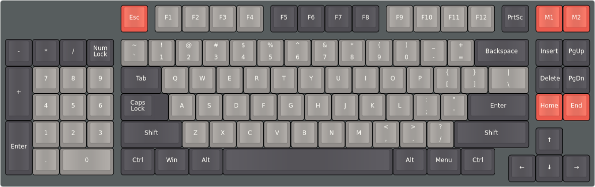

# mk-ltk-01

## Initial Requirements
* As low prifile as possible
* Reasonable price around 100€
* NOT flat profile keycaps
* Tactile
* Left side num pad
* Stardart layout (keycaps wise)
* Make most space for mouse withour loosing functionality (on the right)

## Decisions made
* Sandwich case (stained plywood and painted black steel)
*  Unfortunatelly to high for low profile switches
* Diodes 1N4148
* Gateron Brown
* Plate mounted stabs from Aliexpress
* Krytox GPL 205 G0
* Teensy 2.0++

## Progress

